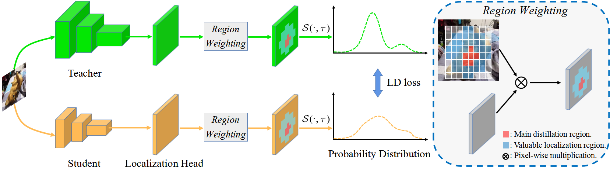

# Localization Distillation for Object Detection 

### English | [简体中文](README_zh-CN.md)

### This repo is based on MMRotate.

This is the code for our paper:
 - [Localization Distillation for Object Detection](https://arxiv.org/abs/2204.05957)
```
@Article{zheng2022rotatedLD,
  title={Localization Distillation for Object Detection},
  author= {Zheng, Zhaohui and Ye, Rongguang and Hou, Qibin and Ren, Dongwei and Wang, Ping and Zuo, Wangmeng and Cheng, Ming-Ming},
  journal={arXiv preprint arXiv:2204.05957},
  year={2022}
}
```

[2021.3.30] LD is officially included in [MMDetection V2](https://github.com/open-mmlab/mmdetection/tree/master/configs/ld), many thanks to [@jshilong
](https://github.com/jshilong), [@Johnson-Wang](https://github.com/Johnson-Wang) and [@ZwwWayne](https://github.com/ZwwWayne) for helping migrating the code.

LD is the extension of knowledge distillation on localization task, which utilizes the learned bbox distributions to transfer the localization dark knowledge from teacher to student.

LD stably improves over rotated detectors without adding any computational cost! 

## Introduction

Previous knowledge distillation (KD) methods for object detection mostly focus on feature imitation instead of mimicking the classification logits due to its inefficiency in distilling the localization information. 
In this paper, we investigate whether logit mimicking always lags behind feature imitation. 
Towards this goal, we first present a novel localization distillation (LD) method which can efficiently transfer the localization knowledge from the teacher to the student. 
Second, we introduce the concept of valuable localization region that can aid to selectively distill the classification and localization knowledge for a certain region. 
Combining these two new components, for the first time, we show that logit mimicking can outperform feature imitation and the absence of localization distillation is a critical reason for why logit mimicking underperforms for years. 
The thorough studies exhibit the great potential of logit mimicking that can significantly alleviate the localization ambiguity, learn robust feature representation, and ease the training difficulty in the early stage. 
We also provide the theoretical connection between the proposed LD and the classification KD, that they share the equivalent optimization effect. 
Our distillation scheme is simple as well as effective and can be easily applied to both dense horizontal object detectors and rotated object detectors. 
Extensive experiments on the MS COCO, PASCAL VOC, and DOTA benchmarks demonstrate that our method can achieve considerable AP improvement without any sacrifice on the inference speed.



## Installation

Please refer to [INSTALL.md](docs/en/install.md) for installation and dataset preparation. Pytorch=1.5.1 and cudatoolkits=10.1 are recommended.

## Get Started

Please see [GETTING_STARTED.md](docs/en/get_started.md) for the basic usage of MMDetection.

## Data Preparation

Please refer to [data_preparation.md](tools/data/README.md) to prepare the data.

## Evaluation

Download https://github.com/CAPTAIN-WHU/DOTA_devkit, which is an official evaluation tool for DOTA.

Move the file `tests/val_set.txt` to `/yourpath/dataset/DOTAv1/`.

Replace `dota_evaluation_task1.py` with our [dota_evaluation_task1.py](tests/dota_evaluation_task1.py), and modify the dictionary of `detpath`, `annopath` and `imagesetfile` to your own path.

After running the test, run 

```python
python yourpath/DOTA_devkit-master/dota_evaluation_task1.py
```

AP, AP50, AP55, ... , AP95 will be printed in the terminal.

## Convert model

If you find trained model very large, please refer to [publish_model.py](tools/model_converters/publish_model.py)

```python
python tools/model_converters/publish_model.py your_model.pth your_new_model.pth
```

###  DOTA-1.0 val
  Rotated-RetinaNet, LD + KD
  |     Teacher     |     Student     | Training schedule |    AP    |    AP50    |    AP70    |    AP90    |  download  |
  | :-------------: | :-------------: | :---------------: | :------: | :--------: | :--------: | :--------: | :--------: |
  |       --        |      R-18       |        1x         |   33.7   |    58.0    |    42.3    |    4.7     | |
  |      R-34       |      R-18       |        1x         |   39.1   |    63.8    |    48.8    |    8.8     | [model](https://drive.google.com/file/d/1ycpNhp4pj1efZNQrcydDmpmHuvnzIykN/view?usp=sharing) |
  
  GWD, LD + KD
  |     Teacher     |     Student     | Training schedule |    AP    |    AP50    |    AP70    |    AP90    |  download  |
  | :-------------: | :-------------: | :---------------: | :------: | :--------: | :--------: | :--------: | :--------: |
  |       --        |      R-18       |        1x         |   37.1   |    63.1    |    46.7    |    6.2     | |
  |      R-34       |      R-18       |        1x         |   40.2   |    66.4    |    50.3    |    8.5     | [model](https://drive.google.com/file/d/1KzK5z4E-ybCD4ksoz93SKErIVVEX3CBC/view?usp=sharing) |

 #### Note: 
 
 - Teacher detector adopts 2x training schedule (24 epochs), student detector adopts 1x (12 epochs)。We use DOTA-v1.0 train set for training, and val set for evaluation。

 - Number of GPU is 2, mini batchsize is 1 per GPU。We found that even though the batchsize was fixed, single GPU training produced higher AP than double GPUs training.

 - On DOTA, we found LD and classification KD are equally important, which can improve the baseline (such as R-RetinaNet) by more than 3.5 AP. And using the combination of LD and KD reaches the highest.

## Acknowledgments

Thank you to [yangxue0827](https://github.com/yangxue0827) for his help of data preparation and his exellent works for rotated object detection.
