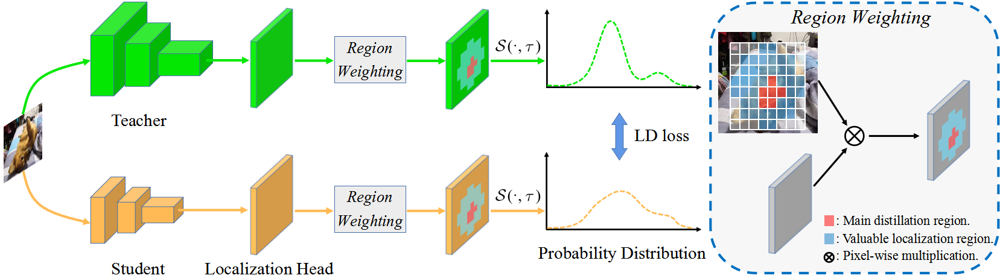

# Localization Distillation for Object Detection 

### [English](README.md) | 简体中文

### 水平框目标检测器的LD代码在 https://github.com/HikariTJU/LD, 基于MMDetection.

### 本代码基于MMRotate框架.

论文解读: [目标检测-定位蒸馏 (LD, CVPR 2022)](https://zhuanlan.zhihu.com/p/474955539), [目标检测-定位蒸馏续集——logit蒸馏与feature蒸馏之争](https://zhuanlan.zhihu.com/p/498119752)

这是我们论文的代码实现
 - [Localization Distillation for Object Detection](https://arxiv.org/abs/2204.05957)

```
@Article{zheng2022rotatedLD,
  title={Localization Distillation for Object Detection},
  author= {Zheng, Zhaohui and Ye, Rongguang and Hou, Qibin and Ren, Dongwei and Wang, Ping and Zuo, Wangmeng and Cheng, Ming-Ming},
  journal={arXiv preprint arXiv:2204.05957},
  year={2022}
}
```

[2021.3.30] LD被集成至[MMDetection V2](https://github.com/open-mmlab/mmdetection/tree/master/configs/ld), 感谢 [@jshilong
](https://github.com/jshilong), [@Johnson-Wang](https://github.com/Johnson-Wang)与[@ZwwWayne](https://github.com/ZwwWayne).

LD是知识蒸馏在目标定位任务上的拓展，利用教师所学习到的定位分布来指导学生的定位学习。

LD可稳定提高旋转检测器精度，几乎无附加计算消耗！

## 简介

以往的目标检测知识蒸馏(KD)方法由于在蒸馏定位信息时效率低下，大多侧重于feature模仿而非模仿分类logit。
在本文中，我们研究了logit模仿是否总是落后于feature模仿。
为了实现这一目标，我们首先提出了一种新的定位蒸馏(LD)方法，可以有效地将定位知识从教师传递给学生。
其次，我们引入有价值定位区域的概念，有助于在特定区域中有选择地蒸馏分类知识和定位知识。
结合这两个新的组件，我们首次证明了logit模仿的表现可优于feature模仿，而缺乏定位蒸馏是logit模仿多年来表现不佳的一个关键原因。
深入的研究表明，logit模仿具有强大的潜力，可以显著缓解定位模糊性，学习到鲁棒的feature表示，并在训练早期阶段缓解训练难度。
我们还提供了LD和分类KD之间的理论联系，它们共享等价的优化效果。
我们的蒸馏方案简单有效，可以很容易地应用于密集水平和旋转目标探测器。
在MS COCO、PASCAL VOC和DOTA基准上的大量实验表明，我们的方法可以在不牺牲推理速度的情况下实现相当大的AP改进。



## 环境安装

参见[INSTALL.md](docs/en/install.md), 里面包含了安装和数据集准备。我们使用的是Pytorch=1.5.1与cudatoolkits=10.1。

## 快速入门

参见[GETTING_STARTED.md](docs/en/get_started.md), 包含了MMDetection的基本使用方法。

## 数据集准备

参见[data_preparation.md](tools/data/README.md)。

## 评估指南

将文件 `tests/val_set.txt` 移动至 `/yourpath/dataset/DOTAv1/` 目录下。

下载官网DOTA评估代码 https://github.com/CAPTAIN-WHU/DOTA_devkit

替换文件 `dota_evaluation_task1.py` 为我们的 [dota_evaluation_task1.py](tests/dota_evaluation_task1.py), 并修改其中 `detpath`, `annopath` and `imagesetfile` 的路径为你的路径。

在运行测试结束后，运行如下命令

```python
python yourpath/DOTA_devkit-master/dota_evaluation_task1.py
```

AP, AP50, AP55, ... , AP95 将在终端打印出来.

## 转换模型

如果你发现蒸馏训练后的模型大小很大，你可以转换模型，参见[publish_model.py](tools/model_converters/publish_model.py)

```python
python tools/model_converters/publish_model.py your_model.pth your_new_model.pth
```

## 评估结果

###  DOTA-v1.0 val
  Rotated-RetinaNet, LD + KD
  |     Teacher     |     Student     | Training schedule |    AP    |    AP50    |    AP70    |    AP90    |  download  |
  | :-------------: | :-------------: | :---------------: | :------: | :--------: | :--------: | :--------: | :--------: |
  |       --        |      R-18       |        1x         |   33.7   |    58.0    |    42.3    |    4.7     | |
  |      R-34       |      R-18       |        1x         |   39.1   |    63.8    |    48.8    |    8.8     | [model](https://drive.google.com/file/d/1ycpNhp4pj1efZNQrcydDmpmHuvnzIykN/view?usp=sharing) |
  
  GWD, LD + KD
  |     Teacher     |     Student     | Training schedule |    AP    |    AP50    |    AP70    |    AP90    |  download  |
  | :-------------: | :-------------: | :---------------: | :------: | :--------: | :--------: | :--------: | :--------: |
  |       --        |      R-18       |        1x         |   37.1   |    63.1    |    46.7    |    6.2     | |
  |      R-34       |      R-18       |        1x         |   40.2   |    66.4    |    50.3    |    8.5     | [model](https://drive.google.com/file/d/1KzK5z4E-ybCD4ksoz93SKErIVVEX3CBC/view?usp=sharing) |
 
 #### 注： 
 
 - 教师模型训练2x (24 epochs)，学生训练1x (12 epochs)。以DOTA-v1.0 train set为训练集，val set为测试集。

 - 训练GPU数量为2，mini batchsize 1 per GPU。经发现，单卡训练可比双卡训练获得更高的精度，即便二者的batchsize相同。

 - 经大量实验，在DOTA上，我们发现LD与KD同等重要，均可在baseline的基础上(如33.7 AP的R-RetinaNet)提高超过3.5 AP，综合LD与KD则达到最高。

 ## 致谢
 
感谢[yangxue0827](https://github.com/yangxue0827)给予的数据集准备的帮助，以及他一系列杰出的旋转目标检测的工作。
